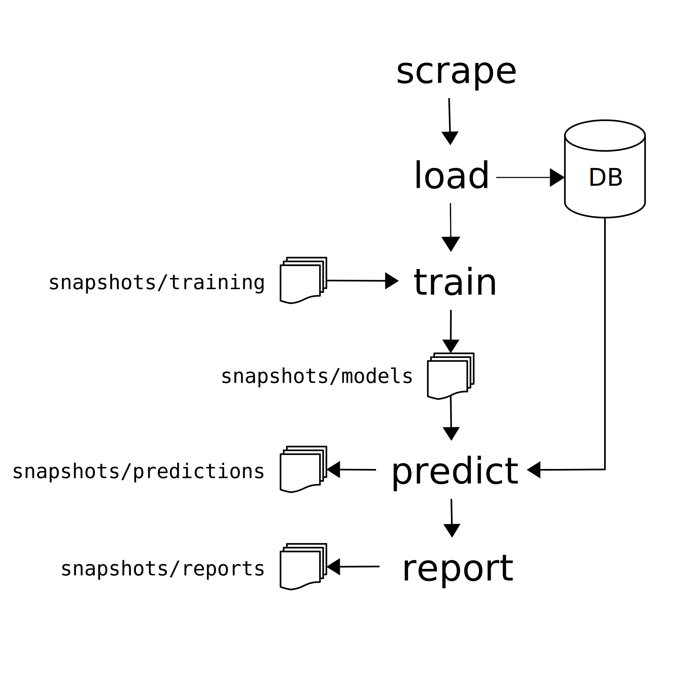

**Jobs Analysis using Machine Information Extraction** (JAMIE) is a tool that
aims to monitor and analyse the number of academic jobs, mainly in the UK, that
require software skills.

**[Documentation](http://data.trenozoic.net/jamie/docs/)** •
**[Dashboard](http://data.trenozoic.net/jamie/reports/latest/)**

## Installation

To install using pip:

    git clone git@github.com:softwaresaved/jamie.git
    cd jamie
    python3 -m venv .venv
    source .venv/bin/activate
    pip install .

## How it works

The CLI tool `jamie` is a wrapper around the Jamie API (see the documentation).
Working with Jamie is akin to a standard machine learning pipeline: we first
train a model and use that to predict whether jobs are software jobs or not.
The final step is the creation of the report.

You can take a look at the **[detailed
workflow](http://data.trenozoic.net/jamie/reports/latest/)** along with the
help for the command line interface, or look at how we **[built the
model](http://data.trenozoic.net/jamie/docs/methods.html)**.

## Example

1. Look at the configuration

       jamie config
       jamie config <configname> <value>   # to set config

2. Download some jobs:

       jamie scrape

3. Load them into local MongoDB:

       jamie load

4. Create the training snapshots folder underneath the common snapshots folder
   (configuration ``common.snapshots``:

       mkdir -p snapshots/training
       cp /path/to/training_set.csv snapshots/training/<date>

5. Train the model:

       jamie train  # Latest snapshot by default

       # If you wanted to use a specific snapshot
       jamie train <snapshot> 

6. The previous command will create model snapshots in ``snapshots/models``. You
   can now use these snapshots to make predictions:

       jamie predict

   This will save the prediction snapshot under ``snapshots/predictions``.

7. Generate report corresponding to the prediction snapshot:

       jamie report

8. The report snapshot will be created in ``snapshots/reports``. The snapshot
   contains an ``index.html`` file which can be opened in a browser. The entire
   folder can be copied to a web server for easier access as well.
