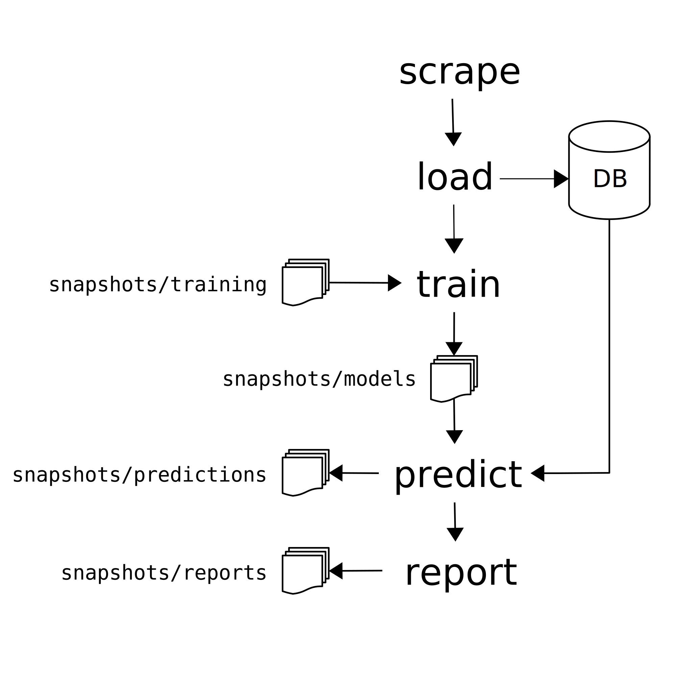

Workflow
--------

Jamie's workflow looks much like a standard machine learning workflow with
training a model to detect the positive job class and using that to predict
classification of new jobs. In addition, Jamie can also scrape new data and
import it into a local MongoDB.

   Workflow pipeline

In the following *positive class job* refers to the job that we are trying to
identify from the pool of jobs. Currently, Jamie supports identification of
Research Software Engineer (RSE) jobs but can be easily extended to support
other job types.

Each of the pipeline stages can be run using ``jamie <stage>``. Some of the
stages accept optional parameters. By default the pipeline will run on the
latest snapshots; see below for more details of how snapshots are organised.

**scrape**
   This is the first stage, in which data is scraped from the
   https://jobs.ac.uk website and stored in a folder. The storage location can
   be configured by setting the ``scrape.folder`` configuration.

**load** [--dry-run]
   Loads scraped data into a local MongoDB instance. Optional argument dry-run
   does not load data into database, just shows warnings about missing attributes.

**train**
   Trains models using the training set snapshot specified.
   Options can be specified in order, or by using hyphenated options (so *snapshot* corresponds to ``--snapshot <name>``. Options:

   * *snapshot*: Which training snapshot to use
   * *features*: Which feature set to use (default "rse")
   * *models*: Specify a comma separated list of models. If not specified,
     runs all models.
   * *prediction-field*: Which column in the training set to use as the label for classification (default "aggregate_tags")
   * *oversampling*: Whether to use oversampling, default True
   * *scoring*: Scoring method to use, default "precision" which is the F1 score

**predict** [*snapshot*]
   Predicts using trained models on dataset stored in MongoDB. Optional snapshot parameter specifies model snapshot to use.

**report** [*snapshot*]
   Generates reports showing various graphs about proportion, mean salary of
   the positive class job. Optional snapshot parameter specifies prediction
   snapshot to use.

In addition to the pipeline commands we also have the following commands

**features**
   List possible feature sets (for use in **train**)

**snapshots**
   List the various kinds of snapshots, takes a parameter, one of
   training, models, predictions or reports.

**version**
   Shows application version information

Configuration
=============

Jamie stores its configuration file by default in
``~/.config/jamie/config.json`` where ``~`` refers to your home folder. The
configuration file can be edited manually, or you can use the ``jamie config``
command to read and set values.

To set a value::

    jamie config <configname> <value>

To read a value::

    jamie config <configname>

The most common parameter that you *may* need to change is the
``common.snapshots`` configuration value. This specifies the location where the
snapshots involved in the workflow are stored. By default this is the folder
where you cloned the Github repository.

Snapshots
=========

Except scrape and load, the other stages in the Jamie workflow use snapshots.
Snapshots allow you to test the pipeline reproducibly. The training set
snapshot is done manually at the moment by naming a file ``training_set.csv``
under ``snapshots/training``. In the training phase, we specify a particular
training snapshot to use and the trained models are stored in
``snapshots/models``. Each snapshot corresponds to a folder under
``snapshots/snapshot_type`` where snapshot_type is one of the applicable snapshot
types.

Each prediction run corresponds to a particular model snapshot (which, in turn,
was built from a particular training snapshot). As prediction pulls data from
MongoDB, each prediction snapshot can be different even if it uses the same
model snapshot.

In the case of reports, each report *does* correspond to a single prediction
snapshot, as reports are just visualisation of the prediction data.

Snapshot folder names are formatted according to the ISO standard:
``YYYY-MM-DDTHH-MM-SS``.

Example
=======

In the following ``$`` denotes the Terminal prompt, which shouldn't be typed.

1. Download some jobs::

    $ jamie scrape

2. Load them into local MongoDB::

    $ jamie load

3. Create the training snapshots folder underneath the common snapshots folder
   (configuration ``common.snapshots``::

    $ mkdir -p snapshots/training
    $ cp /path/to/training_set.csv snapshots/training/<date>

4. Train the model::

    $ jamie train  # Latest snapshot by default

    # If you wanted to use a specific snapshot
    $ jamie train <snapshot>

5. The previous command will create model snapshots in ``snapshots/models``. You
   can now use these snapshots to make predictions::

    $ jamie predict

   This will save the prediction snapshot under ``snapshots/predictions``.

6. Generate report corresponding to the prediction snapshot::

    $ jamie report

7. The report snapshot will be created in ``snapshots/reports``. The snapshot
   contains an ``index.html`` file which can be opened in a browser. The entire
   folder can be copied to a web server for easier access as well.
