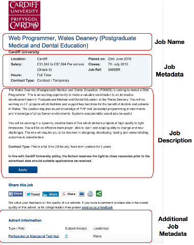

<!-- set up defaults for the R chunks in the document       -->
<!-- see http://yihui.name/knitr/options/ for documentation -->
```{r setup, include=FALSE}

# Global options for knitr
knitr::opts_chunk$set(cache=TRUE, echo=FALSE, warning=FALSE, message=FALSE,
                      comment=NA)

```

```{r load_libraries}
# Required libraries
library(pander)    # Use this for creating tables 
library(scales)    # Use this for the percent function
library(ggplot2)   # Use this for plotting
library(ggmap)     # Plot maps
library(tm)        # Text mining
library(slam)      # Algorithms for sparse matrices

# Global options for pander
panderOptions('table.split.table', Inf)     # Do not split tables
panderOptions('table.style', 'rmarkdown')   # Output in Rmarkdown

```

<!-- read in the data to be used for processing -->
```{r read_data}


# Set the working directory to be where the file is - you can
# add a line for your directory is and only execute that.
hostname<-Sys.info()["nodename"]

# Set the working directory. This should be changed to point
# to the directory that contains this file in your system.
if(hostname == "mbp-ma.local"){
  setwd("/Users/mario/jobs-analysis/scripts") # Apple Macbook
}else if(hostname =="LinuxDesktopName"){
  setwd("/home/mario/jobs-analysis/scripts")   # Linux desktop
}else{
  print("You need to set your current working directory.")
}

# Obtain functions to read and clean data.
source("R/filestuff.R")

# Read in the data into a data frame.
dat<-readJobsFile("../data/jobs.csv")

```

## Aim {.smaller}

The aim of this work is to:

- Help determine the size of the UK Academic Software Research Market
   - Part of the Software Sustainability Research Software Engineer (RSE) Campaign
       - Make RSE a recognised career path within academic institutions

Do this by seeing how many ***Software Jobs*** are advertised

- Identify ***Sofware Jobs***
    - *Any job that requires development of software*
- Draw characteristics about the ***Software Jobs***

<div class="notes">
Where is this work going?

</div>


## Process 

<div class="columns-2">

 - Have been scraping jobs from [www.jobs.ac.uk](http://www.jobs.ac.uk)
    - Started on Sep 10 2014
    - Perl job run at 5am every working day
    - Downloads html fragments
    - html fragments flattened to CSV format by another Perl script
 - Currently have `r length(dat$JobId)` jobs
 - On-going work to examine the data
 
```{r plot_cumulative_job_downloads,fig.width = 4.5, fig.height = 4.5}

# Get dates jobs were placed on
d1 <-as.Date(dat$PlacedOn,"%d/%m/%Y")

# Cumulative sum of frequency plot
tab<-cumsum(table(d1))

# Create a data frame for ggplot
d<-data.frame(freq=as.numeric(tab),date=as.Date(names(tab)),stringsAsFactors = FALASE)

# Produce a bar plot
ggplot(data=d,aes(x=date,y=freq,col="red")) +
  stat_identity(geom="bar") +
  theme(legend.position="none",text = element_text(size=10),
        axis.text.x = element_text(angle=90, vjust=1)) + 
  ylab("Total Number of Jobs Downloaded") +
  geom_vline(xintercept=as.numeric(as.Date("2014-09-10")),colour="blue") +
  geom_text(aes(x=as.Date("2014-08-30"),y=15000,angle=90,size=10,
                label="Start of data collection"),colour="blue") +
  xlab("Dates")


# Remove variables not required
rm(d,tab)
```
</div>

## Anatomy of a job {.smaller}

<div class="columns-2">

  - Job composed of various elements
      - Name
      - Metadata can be parsed and information extracted
      - Description, free text
      - Additional job metadata



</div>

## Time to apply

```{r cumulative_plot}

# Get the job closing dates.
d2 <- as.Date(dat$Closes,"%d/%m/%Y")

# Calculate the number of days the job is open.
d3 <- as.numeric(na.omit(d2-d1))

qplot(d3,geom="bar",colour=I("red"),binwidth=1,xlab ="Days job is open",
     ylab="Number of Jobs",xlim=c(0,100)) + theme(legend.position="none")

# Remove variables that are no longer required
rm(d1,d2,d3)

```


## Naive Bayes

<!--
http://blog.datumbox.com/machine-learning-tutorial-the-naive-bayes-text-classifier/
-->

Have three different types:

- **Multinomial Naive Bayes** - multiple occurrences of words matter
- **Binarized Multinomial Naive Bayes** - frequencies do not matter
- **Bernoulli Naive Bayes** - 


